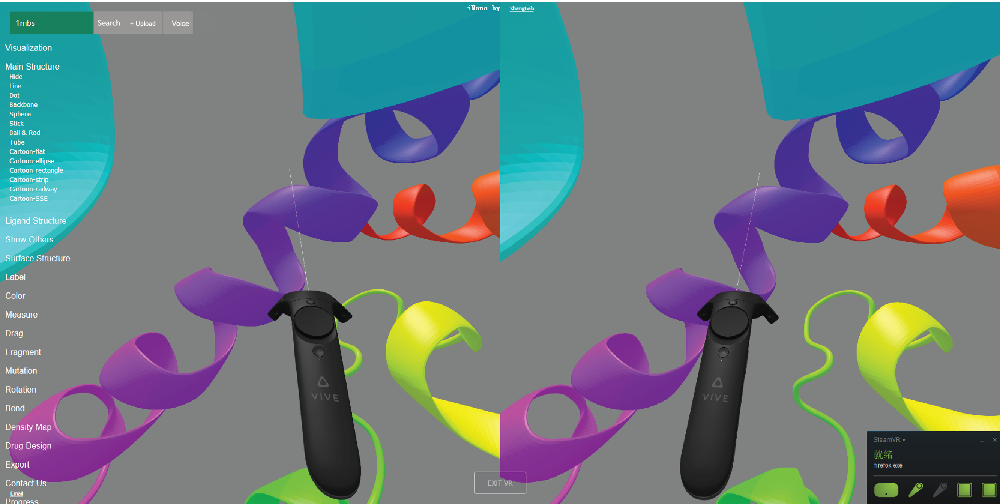

# VRmol: Virtual Reality for Molecular structures 

## Introduction

We leverage the most cutting-edge computational technologies to develop a virtual reality (VR) system - VRmol - that provides the visualization and analysis of macromolecule structures in an infinite virtual environment on the web. VRmol is natively built with WebVR technology, providing all structural analysis functions in a fully immersive, inspiring virtual environment. It is convenient to use, runs on internet and requires no software downloading and installation. And by connecting to a number of cloud-based genomic and drug databases, it provides an integrative platform to perform advanced structural and translational research. It can be freely accessed online by typing https://vrmol.net in local browser. 


## Documentation

Tutorials of VRmol can be accessed at [here](https://vrmol.net/docs).

VRmol provides two modes:
- [**VR Mode**](https://vrmol.net/docs/#header-n5340) will guide you to experience VRmol in Virtual Reality environment.
- [**Desktop Mode**](https://vrmol.net/docs/#header-n5609) will guide you to experience VRmol on the desktop.


## VR Device requirements

 VR devices such as HTC Vive, Oculus Rift, and Microsoft Mix Reality are well-supported by VRmol. More details can be seen at [documentation](https://vrmol.net/docs/#header-n5342).

## Screenshot

A screenshot of structure visualization with stereo view.



## Sharing by URL


### URL Options
You can save a specific structural representation scene by saving operation options setting in VRmol as a URL, like `https://vrmol.net/index.html?id=1dfb&panelShow=0&mainMode=7&showSurface=0&surfaceOpc=0.5&surfaceType=1&colorMode=602`. And then you can load and share the scene by opening this previously-saved URL in the web browser or embedding it into your own website by using `iframe`, such as

```html
<iframe src="https://vrmol.net/index.html?id=1dfb&panelShow=0&mainMode=7&showSurface=1&surfaceOpc=0.5&surfaceType=1" />
```


The options and their data types supported in VRmol are shown in the table below.

| Options    | Data Type |Value  |Comment|
| :------ | :------ |:------ |:------ |
| id | String|PDB code|4 charactors|
|panelShow|Integer|Show:1,Hide:0|Show menu panel or not|
|mainMode|Integer|LINE : 1, DOT : 2,BACKBONE : 3,  SPHERE: 4,STICK : 5, BALL_AND_ROD : 6,TUBE : 7,  RIBBON_FLAT:8, RIBBON_ELLIPSE:9, RIBBON_RECTANGLE:10, RIBBON_STRIP:11, RIBBON_RAILWAY:12, CARTOON_SSE:13,SURFACE:14|Main Structure Representation|
|showSurface|Integer|Show:1,Hide:0|Show surface panel or not|
|surfaceOpc|Float|0~1|Transparency of surface|
|surfaceType|Integer|Van der Waals surface:1, solvent excluded surface:2, solvent accessible surface:3, molecular surface:4|Surface type|
|colorMode|Integer|Element:601, Residue:602, Secondary Structure:603, Chain:604, Representation:605, B-Factor:606", "Spectrum:607, Chain Spectrum:608, Hydrophobicity:609|Color schemes|
|travel|Integer|Show:1,Hide:0|Enter travel mode or not|


### Examples for API 

Present structure (PDB code:`1MBS`) with `Ball & Rod` style and hide the menu panel.
```html
<iframe src="https://vrmol.net/index.html?id=1mbs&panelShow=0&mainMode=6" />
```


Present structure (PDB code:`1DDB`) with `Tube` style and show its Van der Waals surface with transparency (0.5), and hide the menu panel.
```html
<iframe src="https://vrmol.net/index.html?id=1dfb&panelShow=0&mainMode=7&showSurface=1&surfaceOpc=0.5&surfaceType=1"  />
```

## Deploy VRmol in local

  - Download the code into the apache server web directory
  - Set `SERVERURL` as your URL (like http://localhost) at libs/molecule/PDBCore.js
  
